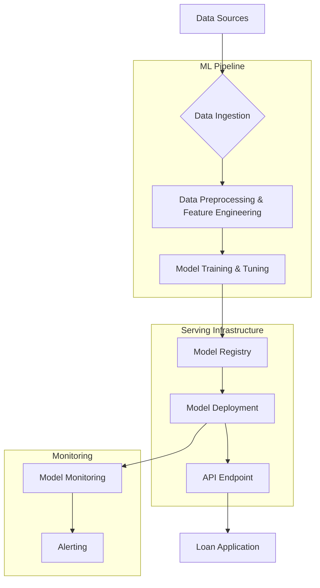

# Loan Default Prediction

An end-to-end machine learning project to predict loan default risk. Includes Exploratory Data Analysis (EDA), feature engineering, a Gradient Boosting model, and a proposed system architecture for deployment.

---

## Table of Contents

- [Project Overview](#project-overview)
- [Features](#features)
- [System Architecture](#system-architecture)
- [Model Performance](#model-performance)
- [Getting Started](#getting-started)
  - [Prerequisites](#prerequisites)
  - [Installation](#installation)
- [Usage](#usage)

---

## Project Overview

For financial institutions, the ability to predict loan defaults is a critical factor in managing financial risk and maintaining profitability. This project addresses this challenge by building a robust machine learning model to predict the likelihood of a borrower defaulting on a loan.

The solution involves a complete MLOps workflow, from data ingestion and analysis to model training, deployment, and monitoring. By leveraging a Gradient Boosting Classifier, the model provides a reliable risk score that can be integrated into a real-time loan application system.

## Features

*   **Exploratory Data Analysis (EDA):** A detailed analysis of the dataset is provided in the `eda.ipynb` notebook, including visualizations of feature distributions and correlations.
*   **Data Cleaning & Preprocessing:** A robust pipeline handles missing values, converts data types, and scales features to prepare the data for modeling.
*   **Feature Engineering:** New, insightful features were created to improve model accuracy, such as `Credit_to_Income_Ratio` and `Employment_Years`.
*   **Imbalanced Data Handling:** The project uses the **SMOTE (Synthetic Minority Over-sampling Technique)** to address the significant class imbalance in the dataset, ensuring the model learns to identify the minority class (defaulters) effectively.
*   **Model Training & Tuning:** A Gradient Boosting Classifier is trained and optimized using `GridSearchCV` to achieve the best possible performance.
*   **End-to-End MLOps Pipeline:** The project includes a proposed system architecture for a complete CI/CD pipeline, covering everything from automated training to model deployment and monitoring.

---

## System Architecture

The proposed architecture for deploying the model into a production environment is designed for scalability, reliability, and continuous improvement. It consists of an automated ML pipeline for training and a serving infrastructure to deliver real-time predictions.



---

## Model Performance

The final Gradient Boosting model was evaluated on a hold-out test set. The key performance metrics are:

*   **AUC-ROC Score:** **[Run the `eda.ipynb` notebook to generate this value]**

Below are the visualizations of the model's performance and the most important features driving its predictions. 

*(To generate these images, please run the `eda.ipynb` notebook.)*

**ROC Curve**

*(Placeholder for ROC Curve image)*

**Top 20 Most Important Features**

*(Placeholder for Feature Importance plot)*

---

## Getting Started

Follow these instructions to set up and run the project on your local machine.

### Prerequisites

*   Python 3.7+
*   Jupyter Notebook or JupyterLab

### Installation

1.  **Clone the repository:**
    ```bash
    git clone https://github.com/your-username/Loan-Default-Prediction.git
    cd Loan-Default-Prediction
    ```

2.  **Install the required packages:**
    ```bash
    pip install -r requirements.txt
    ```
    *(Note: A `requirements.txt` file is recommended. For now, you can install the packages listed in the notebook.)*

---

## Usage

To explore the data, train the model, and see the results, run the Jupyter notebook:

```bash
jupyter notebook eda.ipynb
```

Inside the notebook, you can execute the cells sequentially to see the entire process, from data loading to model evaluation.