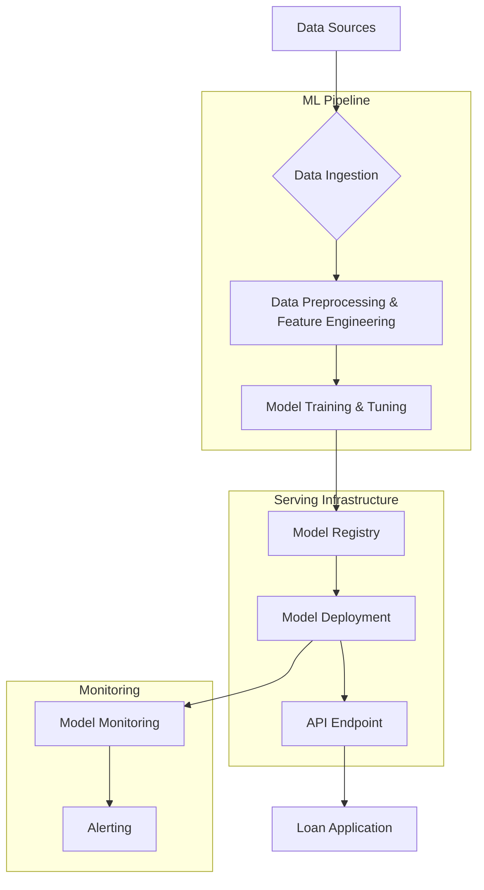

# System Architecture for Loan Default Prediction

## Deployment Process

This diagram illustrates the end-to-end architecture for deploying the loan default prediction model.

### Components:

*   **Data Sources:** The raw data for loan applications.
*   **Data Ingestion:** A process to collect and store the data.
*   **Data Preprocessing & Feature Engineering:** The data is cleaned, transformed, and new features are created.
*   **Model Training & Tuning:** The Gradient Boosting model is trained and tuned on the prepared data.
*   **Model Registry:** The trained model is versioned and stored in a central registry.
*   **Model Deployment:** The model is deployed as a REST API for real-time predictions.
*   **API Endpoint:** The deployed model is exposed through an API endpoint.
*   **Loan Application:** The loan application system interacts with the API to get predictions.
*   **Model Monitoring:** The model's performance is continuously monitored for drift and other issues.
*   **Alerting:** Alerts are triggered if the model's performance degrades.
